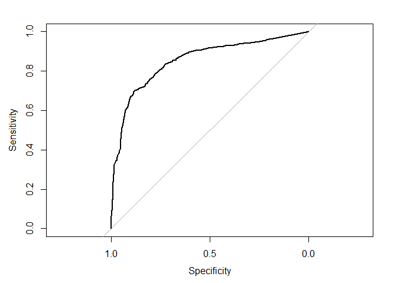

  - [load dataset](#load-dataset)
  - [classify yeast and human
    proteins](#classify-yeast-and-human-proteins)
  - [differential detection](#differential-detection)
  - [ROC](#roc)
  - [print true/false-positives for topN
    hits](#print-truefalse-positives-for-topn-hits)

Basic example to illustrate differential detection testing in MS-DAP
using the LFQbench dataset.

## load dataset

1.  load the Skyline output of the LFQbench study (this file is bundled
    with the MS-DAP package as a test dataset).

2.  extract the respective group/condition of each sample by matching a
    regular expression against the filenames. This is just to
    demonstrate a more advanced convenience method that may come in
    handy for bioinformatic analyses, in typical MS-DAP workflows, the
    sample metadata is loaded from file (a csv or Excel table), see the
    ‘getting started’ vignette.

3.  finally, we define the contrast: group A versus group B.

note; for LFQbench dataset, the sample groups are taken from
process\_hye\_samples.R @
<https://www.ebi.ac.uk/pride/archive/projects/PXD002952/files>

``` r
library(msdap)

f <- system.file("extdata", "Skyline_HYE124_TTOF5600_64var_it2.tsv.gz", package = "msdap")
dataset = import_dataset_skyline(f, confidence_threshold = 0.01, return_decoys = F, acquisition_mode = "dia")
#> info: reading Skyline report...
#> info: 4 unique target (plain)sequences ambiguously mapped to multiple proteins and thus removed. Examples; TTDVTGTIELPEGVEMVMPGDNIK, LNIISNLDCVNEVIGIR, LMDLSINK, EVDEQMLNVQNK
#> info: 34263/35943 precursors remain after selecting the 'best' precursor for each modified sequence

dataset = sample_metadata_custom(dataset, group_regex_array = c(A = "007|009|011", B = "008|010|012") )

dataset = setup_contrasts(dataset, contrast_list = list(c("A", "B")))

print(dataset$samples %>% select(sample_id, group))
#> # A tibble: 6 x 2
#>   sample_id           group
#>   <chr>               <chr>
#> 1 lgillet_L150206_007 A    
#> 2 lgillet_L150206_009 A    
#> 3 lgillet_L150206_011 A    
#> 4 lgillet_L150206_008 B    
#> 5 lgillet_L150206_010 B    
#> 6 lgillet_L150206_012 B
```

## classify yeast and human proteins

Use MS-DAP utility function to easily recognize the human and yeast
proteins, while ignoring ecoli proteins or ambiguous proteingroups (that
match multiple of these classes).

``` r
dataset$proteins$classification = regex_classification(dataset$proteins$fasta_headers, regex=c(human="_HUMA", yeast="_YEAS", discard="_ECOL"))
print(table(dataset$proteins$classification))
#> 
#> discard   human   yeast 
#>    1312    3062    1786
```

## differential detection

``` r
# compute MS-DAP differential detect scores for all contrasts
dataset = differential_detect(dataset)
#> progress: caching filter data took 2 seconds

# add the yeast/human protein classifications to differential detect score tibble and filter to only keep human and yeast proteins
tib_plot = left_join(dataset$dd_proteins, dataset$proteins, by="protein_id") %>%
  filter(classification %in% c("human", "yeast"))

# histogram the scores, color-coded by classification
print( ggplot(tib_plot, aes(x=diff_detect_zscore, fill=classification)) + 
         geom_histogram(bins=25) )
```

<!-- -->

## ROC

``` r
roc_obj = pROC::roc(tib_plot$classification, abs(tib_plot$diff_detect_zscore), levels=c("human", "yeast"), direction="<")
pROC::plot.roc(roc_obj)
```

<!-- -->

## print true/false-positives for topN hits

Sort all proteins by absolute differential detection score, take top 50
hits, count how many are yeast/human.

The high true positive rate indicates this simple metric could be suited
to complement the differential expression analyses (DEA) which is based
on peptide abundance values, particularly to rank those proteins that
lack data points in one experimental condition but not the other (eg;
proteins on which no DEA is possible).

``` r
print( tib_plot %>% 
         arrange(desc(abs(diff_detect_zscore))) %>% 
         head(50) %>% 
         count(classification) )
#> # A tibble: 2 x 2
#>   classification     n
#>   <chr>          <int>
#> 1 human              2
#> 2 yeast             48
```
