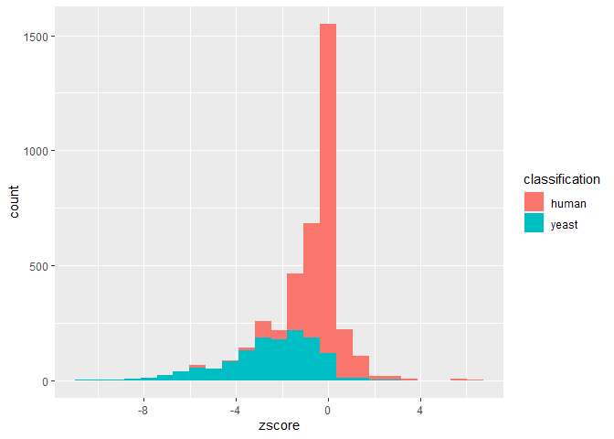

# Differential Detection

In this vignette we will demonstrate a basic metric for “differential
detection” that is implemented in MS-DAP. Analogous to the [DEA
vignette](differential_expression_analysis.md), we will apply MS-DAP to
the LFQbench dataset but instead of testing the differences in
peptide/protein abundance values, we here compare the number of detected
peptides over replicates between sample groups/conditions.

note: in the code blocks shown below (grey areas), the lines that start
with `#>` are the respective output that would be printed to the console
if you run these code snippets on your computer

## load dataset

1.  load the Skyline output of the LFQbench study (this file is bundled
    with the MS-DAP package, you don’t have to download anything).

2.  extract the respective group/condition of each sample by matching a
    regular expression against the filenames. This is just to
    demonstrate a more advanced utility function that may come in handy
    for bioinformatic analyses. In typical MS-DAP workflows, the sample
    metadata would be loaded from file (a csv or Excel table), as
    demonstrated in the [user guide](userguide.md).

3.  finally, we define the contrast: group A versus group B.

note; the sample-to-condition assignments were taken from
`process_hye_samples.R` @
<https://www.ebi.ac.uk/pride/archive/projects/PXD002952/files>

``` r
library(msdap)

f <- system.file("extdata", "Skyline_HYE124_TTOF5600_64var_it2.tsv.gz", package = "msdap")
dataset = import_dataset_skyline(f, confidence_threshold = 0.01, return_decoys = F, acquisition_mode = "dia")
#> info: reading Skyline report...
#> info: 4 unique target (plain)sequences ambiguously mapped to multiple proteins and thus removed. Examples; TTDVTGTIELPEGVEMVMPGDNIK, LNIISNLDCVNEVIGIR, LMDLSINK, EVDEQMLNVQNK
#> info: 34263/35943 precursors remain after selecting the 'best' precursor for each modified sequence

dataset = sample_metadata_custom(dataset, group_regex_array = c(A = "007|009|011", B = "008|010|012") )

dataset = setup_contrasts(dataset, contrast_list = list(c("A", "B")))
#> info: contrast: A vs B

print(dataset$samples %>% select(sample_id, group))
#> # A tibble: 6 x 2
#>   sample_id           group
#>   <chr>               <chr>
#> 1 lgillet_L150206_007 A    
#> 2 lgillet_L150206_009 A    
#> 3 lgillet_L150206_011 A    
#> 4 lgillet_L150206_008 B    
#> 5 lgillet_L150206_010 B    
#> 6 lgillet_L150206_012 B
```

## classify yeast and human proteins

We here use a MS-DAP utility function to easily recognize the Human and
Yeast proteins, while ignoring E. Coli proteins and ambiguous
proteingroups (that match multiple of these classes). The
`regex_classification()` function applies the provided regular
expressions to the fasta headers of all proteins in each proteingroup to
determine classifications. If no fasta files were loaded prior to this,
as is the case in this example, the regular expressions are applied to
the protein identifiers instead.

``` r
dataset$proteins$classification = regex_classification(dataset$proteins$fasta_headers, regex=c(human="_HUMA", yeast="_YEAS", ecoli="_ECOL"))
print(table(dataset$proteins$classification))
#> 
#> ecoli human yeast 
#>  1312  3062  1786
```

## differential detection

We here run the differential detection function in MS-DAP that computes
a z-score for each protein based on the total number of detected
peptides per sample group. Further details for the computational
procedures are available at the *differential detection* section of the
[introduction vignette](intro.md).

``` r
# compute MS-DAP differential detect scores for all contrasts, only for proteins that were observed in at least 3 samples in either sample group/condition
dataset = differential_detect(dataset, min_samples_observed = 3)
#> progress: caching filter data took 1 seconds
#> info: differential detection analysis: min_samples_observed=3

# add the yeast/human protein classifications to differential detect score tibble and filter to only keep human and yeast proteins
tib_plot = left_join(dataset$dd_proteins, dataset$proteins, by="protein_id") %>%
  filter(classification %in% c("human", "yeast"))

# histogram the scores, color-coded by classification
print( ggplot(tib_plot, aes(x=zscore_count_detect, fill=classification)) + 
         geom_histogram(bins=25) )
```

<!-- -->

## print true/false-positives for topN hits

To inspect the extreme values from differential detection analysis, we
here sort all proteins by absolute differential detection score, take
top 50 hits and count how many are yeast/human.

``` r
print( tib_plot %>% 
         arrange(desc(abs(zscore_count_detect))) %>% 
         head(50) %>% 
         count(classification) )
#> # A tibble: 2 x 2
#>   classification     n
#>   <chr>          <int>
#> 1 human              2
#> 2 yeast             48
```

Taken together, the high true positive rates from this simplified
approach that is only based on detection counts suggests it could
complement the differential expression analyses (DEA) which is based on
peptide abundance values, particularly to rank those proteins that lack
data points in one experimental condition but not the other (eg;
proteins on which no DEA is possible). In our hands, this approach has
proven particularly useful in wildtype *vs* knockout APMS datasets
measured in Data Dependent Acquisition mode which yields many proteins
that have observed peptides in one condition but very few in the other
(thus cannot be used in DEA).

## ROC

Additionally, we can visualize the differential detection z-scores by
ROC to show these scores are much better than random (but ROC
performance is not as good as DEA based on peptide abundance values
obviously).

``` r
roc_obj = pROC::roc(tib_plot$classification, abs(tib_plot$zscore_count_detect), levels=c("human", "yeast"), direction="<")
pROC::plot.roc(roc_obj)
```

<!-- -->
