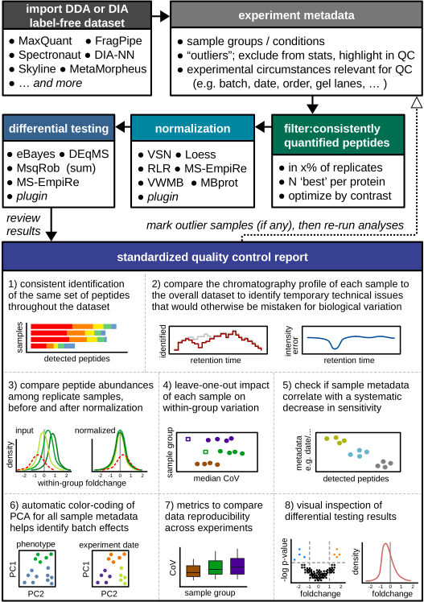
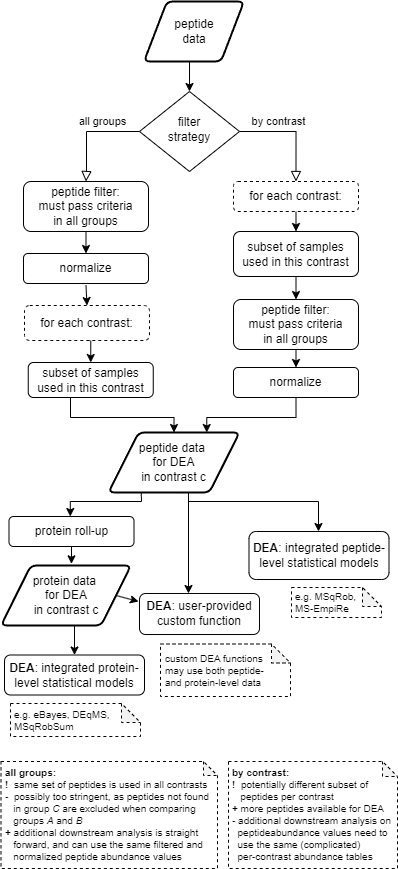
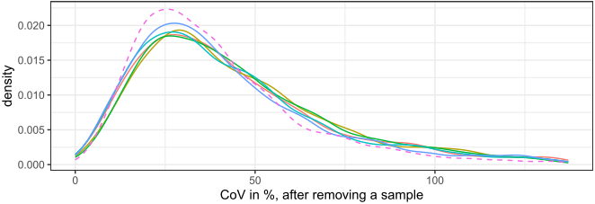
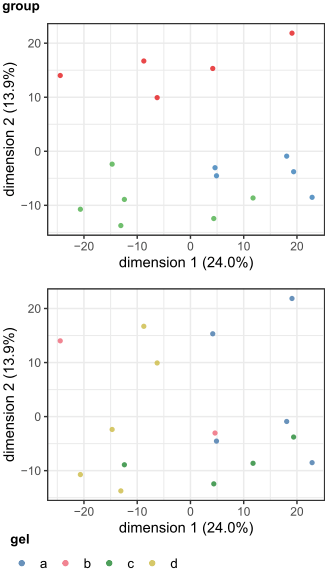
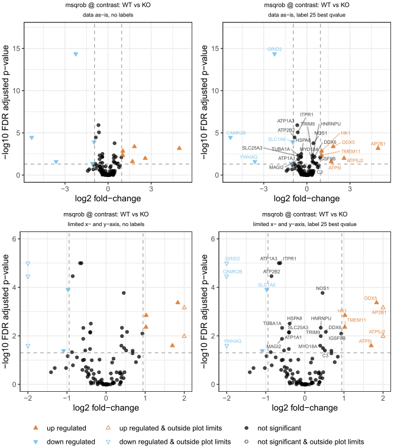

  - [abstract](#abstract)
  - [Features](#features)
  - [Computational procedures involved in differential expression
    analysis](#computational-procedures-involved-in-differential-expression-analysis)
      - [DEA-workflow: feature
        selection](#dea-workflow-feature-selection)
      - [DEA-workflow: normalization](#dea-workflow-normalization)
      - [differential detection](#differential-detection)
      - [estimating foldchange
        thresholds](#estimating-foldchange-thresholds)
  - [Quality Control](#quality-control)
      - [sample metadata](#sample-metadata)
      - [detect counts](#detect-counts)
      - [chromatography](#chromatography)
      - [within-group foldchange
        distributions](#within-group-foldchange-distributions)
      - [CoV leave-one-out analysis](#cov-leave-one-out-analysis)
      - [PCA](#pca)
      - [use the MS-DAP multifaceted analyses in QC
        analysis](#use-the-ms-dap-multifaceted-analyses-in-qc-analysis)
      - [Volcano plot](#volcano-plot)
      - [protein foldchanges estimated by statistical
        models](#protein-foldchanges-estimated-by-statistical-models)
  - [Example of a full report](#example-of-a-full-report)

This document provides an introduction to MS-DAP; what is it and how
does it work, together with highlights from the MS-DAP quality control
report.

Instead of demonstrating MS-DAP using output from a single
‘representative’ dataset, we have collected interesting
samples/datasets specifically to highlight several quality control
analyses and issues you may encounter while working with your data.

*For a hands-on tutorial that shows how to perform MS-DAP analyses
together with a description of settings and recommended defaults, please
refer to the **getting started** vignette.*

## abstract

Essential steps in the interpretation of any mass spectrometry based
proteomics experiment are quality control and statistical analysis of
protein abundance levels. In this rapidly moving field novel algorithms
are being developed and many tools have become available for the various
downstream analysis steps of label-free proteomics data leading to an
extensive patchwork of tools and analyses used throughout the proteomics
community. With MS-DAP we present a data analysis pipeline that
facilitates reproducible proteome science through extensive quality
control, integration of state-of-the-art algorithms for differential
testing and intuitive visualization and reporting. Feature selection
criteria can be configured such that differential testing is only
performed on the subset of reliably quantified peptides. Custom
functions for normalization or differential expression analysis can be
used as a plugin to encourage inclusion of future algorithmic
innovations.

## Features



MS-DAP, Mass Spectrometry Downstream Analysis Pipeline:

  - Analysis independent of RAW data processing software
  - Wide selection of normalization algorithms and statistical models
  - Plugin architecture to support future algorithms
  - Standardized workflow, regardless of configured feature selection
    and data processing algorithms
  - Extensive data visualization, including both popular/common plots
    and novelties introduced by MS-DAP, covering many quality control
    aspects
  - The report is a single PDF, making your results easy to share online
  - The publication-grade figures are stored as vector graphics, so
    simply open the report PDF in Adobe Illustrator to include any of
    the MS-DAP visualizations as panels in your main figures
  - Available as a Docker container and R package

## Computational procedures involved in differential expression analysis

Various computational procedures can be selected in the Differential
Expression Analysis (DEA) (Flowchart). MS-DAP provides two distinct
peptide filtering strategies, dataset wide or separately for each
contrast, in a highly configurable framework that allows users to
configure feature selection, normalization and DEA algorithms of choice.



### DEA-workflow: feature selection

Feature selection is an important first step in which one decides on
which peptides represent reliable data that should be used in downstream
statistical analysis. The following criteria are available to determine
whether a peptide is ‘valid’ in a sample group:

  - identified in at least N samples
  - identified in at least x% of samples
  - quantified in at least N samples
  - quantified in at least x% of samples
  - topN peptides per protein; after above filters, rank peptides by the
    number of samples where detected and their overall CoV and keep the
    top N
  - the respective protein has at least N peptides that pass the above
    filters

‘identified’ refers to peptide *p* in sample *s* was identified through
MS/MS for DDA datasets, or identified with a confidence qvalue \<= 0.01
for DIA datasets. Quantified refers to datapoints either identified and
quantified or not identified but their abundance was inferred through
match-between-runs.

### DEA-workflow: normalization

A second important step is to choose the normalization procedure. There
are different normalization algorithms available in MS-DAP:

  - median, simply scale each sample such that the median value is the
    same throughout the dataset
  - VSN, from vsn R package (justvsn)
  - Loess, from limma R package; normalizeCyclicLoess(log2\_data,
    iterations = 10, method = “fast”)
  - RLR, from MSqRob R package; normalizeRLR @
    <https://github.com/statOmics/MSqRob/blob/MSqRob0.7.6/R/preprocess_MaxQuant.R>
  - MS-EmpiRe, mode normalization as implemented in msEmpiRe R package
  - VWMB, Variation Within Mode Between (novel, manuscript is a
    work-in-progress)
  - modebetween, application of VWMB to only normalize between groups
    (replicates within each group are all scaled in the exact same
    manner)

### differential detection

The differential detection function in MS-DAP computes a z-score for
each protein based on the total number of detected peptides per sample
group.

To easily prioritize proteins-of-interest, some which may not have
sufficient abundance values for differential expression analysis but
that do have many more detects in one sample group than the other, we
provide a simple score based on identification count data.

This is a simplified approach that is intended to rank proteins for
further qualitative analysis, be careful of over-interpretation and keep
differences in sample group size (\#replicates) and the absolute amount
of peptides identified in a sample in mind \!

Computational procedures for comparing sample groups *A* and *B*; \* to
account for sample loading etc., first scale the weight of all peptides
per sample as; 1 / total number of detected peptides in sample *s* \*
*score\_pA*: the score for protein *p* in sample group *A* is the sum of
the weighted score of all peptides that belong to protein *p* in all
samples (within group *A*) \* ratio for protein *p* in *A vs B*:
log2(*score\_pB* + *minimum non-zero score in group B*) -
log2(*score\_pA* + *minimum non-zero score in group A*) \* finally, we
standardize all protein ratios by subtracting the overall mean value,
then dividing by the standard deviation \* proteins of interest,
*candidates*, are defined as proteins with an absolute z-score of at
least 2 AND at least a count difference between groups *A* and *B* of
*group size* \* 0.75 (the latter guards against proteins with 0 detect
in one group and 1 peptide in 1 sample in the other)

### estimating foldchange thresholds

In Differential Expression Analysis (DEA), one can optionally provide a
log2 foldchange threshold as an additional criterion (besides p-values)
for proteins to be considered statistically significant. Instead of
choosing an arbitrary threshold value, MS-DAP can estimate an
appropriate value from your data by bootstrapping analyses that permute
sample-to-condition assignments.

Permutations of sample labels within a sample group are disregarded as
these have no effect on the between-group foldchange, only unique
combinations of swapping *k* samples (where *k* is 50% of replicates
within a group) between conditions *A* and *B* are considered. From the
distribution of foldchanges generated after N iterations, we select the
foldchange value at the 95% quantile of all permutations as the
threshold (cannot infer a-symmetric foldchange thresholds from the
permutation data, so take the largest absolute value at *p = 0.95*;
`max(abs(quantile(fc_matrix, probs = c(1-p, p), na.rm = T)))`).

This is somewhat similar to the method described by Hafemeister and
Satija at <https://doi.org/10.1186/s13059-019-1874-1>

## Quality Control

MS-DAP builds a report that allows in depth quality control (QC).
Building blocks of the QC report are:

  - individual samples analyzed through identified peptides and
    chromatographic effects
  - reproducibility & outliers visualized among replicates
  - presentation of dataset-wide effects; identification of batch
    effects through PCA
  - information needed to reproduce results

The QC report can be used to evaluate data that thereafter is
subsequently re-analyzed. For instance, after inspection the report
users are encouraged to flag suspicious samples as ‘exclude’ so they are
not taken into account during differential abundance analysis, instead
of removing them from the dataset entirely. By keeping all samples in
the dataset the MS-DAP QC report enables transparancy and shows *why*
samples were removed.

In the sections below a subset of all MS-DAP QC figures is highlighted
to showcase the wide scope of quality control included. To see what a
full QC report looks like, you can directly view the results of the
quickstart example from the installation guide by [clicking this
download
link](/examples/data/dataset_Klaassen2018_pmid26931375_report.pdf).

### sample metadata

MS-DAP allows you to inspect potential sources of bias in the sample
set. We therefore strongly encourage annotation of the samples in your
dataset with experimental conditions relevant for QC, such as experiment
batch, SDS-PAGE gel number (if multiple were used), order of sample
processing and measurement, etc. This sample metadata can be provided as
a table (Excel or plain-text csv/tsv).

MS-DAP generates a template file that is almost ready to go, you only
have to open it in Excel and provide the sample groups and add
additional columns that describe experimental conditions\!

For example, after you’ve loaded your dataset (eg; on the next line
after `msdap::import_dataset_skyline(...)`) you can write a sample
metadata template file using
`msdap::write_template_for_sample_metadata(dataset, filename =
"C:/temp/samples.xlsx")`, edit it in Excel, close Excel, then read it
back into R using `msdap::import_sample_metadata(dataset, filename =
"C:/temp/samples.xlsx")`.

### detect counts

The number of detected peptides in a sample, as compared to other
samples in the dataset, is a proxy for experiment quality.

In this example we apply MS-DAP to an in-house DDA dataset that makes
use of SDS-PAGE gels to demonstrate how MS-DAP automatically generates
QC figures for all provided sample metadata. In this dataset, we have 4
gels (a-d) and the location on the gel is also annotated (note that for
one sample we merged gel lanes 4 and 5, in the sample metadata table we
simply denoted this as ‘4 + 5’).

Below figures are a screenshot from the QC report; the first panel
describes all sample metadata provided in this dataset, samples on each
row are color-coded according to respective metadata. The Following
panels further detail each row of this figure. Taken together, these
allow you to identify whether some technical aspect coincides with a
systematic reduction in peptide identification.

In this example, gel d clearly was the most successful ‘experiment
batch’ and we observe a troublesome difference in peptide detection
counts between gels.


### chromatography

MS-DAP quality control analyses can help identify temporary problems
while a sample elutes over the HPLC column. This allows to identify
technical problems that may otherwise be mistakingly interpreted as
biological effects.

For instance, suppose that sensitivity is strongly reduced (or the
column is blocking) for a 10 minute period which results in decreased
peptide intensities for the respective peptides eluting at the time. Or
the sensitivity slowly decreases over time. Without quality control that
considers the dimension ‘retention time’, we may not be aware of such
problems but with MS-DAP we are. In fact, by including these analyses in
the standard quality control repertoire, the presence or absence of
technical issues is completely transparent to any reader of the QC
report.

In the example below, we apply MS-DAP to an in-house SWATH-MS dataset
where some measurements suffered from a temporary loss of measurement
sensitivity. The first figure shows sample WT4; a typical example. The
figure after shows sample KO5; note the drop in the number of detected
peptides (top panel) and peptide abundances (bottom panel) at iRT 25
minutes.

**Typical sample:**


**Problematic sample; temporary drop in sensitivity**


**Figure legends:** The top panel shows the number of peptides in the
input data, e.g. as recognized by the software that generated input for
this pipeline, over time (black line). For reference, the grey line
shows the median amount over all samples (note; if this is the exact
same in all samples, the grey line may not be visible as it falls behind
the black line).

The middle panel indicates whether peptide retention times deviate from
their median over all samples (blue line). The grey area depicts the 5%
and 95% quantiles, respectively. The line width corresponds to the
number of peptides eluting at that time (data from first panel).
Analogously, the bottom panel shows the deviation in peptide abundance
as compared to the median over all samples (red line).

### within-group foldchange distributions

*the need for another new figure*

The QC report includes a visualization of each sample’s overall peptide
abundance distributions (not shown here), which is a good indication of
overall differences in sample loading and/or mass-spec sensitivity.
However, plotting abundance distributions for replicate measurements are
sometimes mistaken for a sign of reproducibility of individual
peptide/protein abundance values (it is not). For instance, if we would
randomize the labels in one of the replicates the overall
peptide/protein abundance distribution does not change but there surely
are foldchanges in peptide/protein abundances.

*solution provided by MS-DAP*

The foldchange of all peptides in a sample is compared to their
respective mean value over all samples in the group. This visualizes how
strongly each sample deviates from other samples in the same group which
helps identify outlier samples. In this analysis, the distributions are
ideally centered narrowly around zero.

*example*

In the example below, we apply MS-DAP to an in-house DDA dataset and
show a screenshot of the foldchange distributions for a sample group
where;

1)  the reproducibility is not great, although normalization helps the
    distributions don’t overlap very well and are quite wide
    (considering the x-axis are log2 foldchanges and these were supposed
    to be biological replicates)

2)  the sample we marked as ‘exclude’ in the sample metadata table
    (dashed line) clearly is an outlier compared to the other samples in
    the group

**Figure legends:** The left- and right-side panels show results of the
same analysis applied before and after application of normalization,
respectively. Each line represents a sample and color-coding is
consistent between panels. Samples marked as ‘exclude’ in the provided
sample metadata table are visualized as dashed lines.

Note that this example figure is based on an in-house dataset (selected
for its outliers that nicely illustrate this figure), so a legend that
shows the sample names and their respective color-coding is omitted here
but available in any QC report of course.


### CoV leave-one-out analysis

Downstream statistical analyses are empowered if the variation in
peptide abundance values between replicated samples is lowered.

These analyses describe the effect of removing a particular sample prior
to within−group Coefficient of Variation (CoV) computation. The lower
the CoV distribution is for a sample, the better reproducibility we get
by excluding it. Only sample groups with at least 4 replicates can be
used for this analysis, so 3 samples remain after leaving one out.
Samples marked as ‘exclude’ in the provided sample metadata are included
in these analyses (shown as dashed lines), and only peptides with at
least 3 data points across replicates samples (after leave-one-out) are
used for each CoV computation.

Basically, CoV distributions as visualized here are like the left-half
of a violin plot and the same criteria apply as with CoV
box/violin-plots; ideally the majority of features have a low CoV, so
the density shows a big hump close to zero and few values to the right
(high CoV).

In the example below, we apply MS-DAP to an in-house DDA dataset and
observe that the mode of the CoV distribution is much lower after
removing the purple sample (already marked as ‘exclude’ in sample
metadata).



**Figure legends:** Samples marked as ‘exclude’ in the provided sample
metadata table are visualized as dashed lines.

Note that this example figure is based on an in-house dataset (selected
for its outliers that nicely illustrate this figure), so a legend that
shows the sample names and their respective color-coding is omitted here
but available in any QC report of course.

### PCA

A visualization of the first three PCA dimensions illustrates sample
clustering. The goal of these figures is to detect global effects from a
quality control perspective, such as samples from the same experiment
batch clustering together, not to be sensitive to a minor subset of
differentially abundant proteins (for which specialized statistical
models can be applied downstream).

If additional sample metadata was provided, such as experiment batch,
sample-prep dates, gel, etc., multiple PCA figures will be generated
with respective color-codings. Users are encouraged to provide relevant
experiment information as sample metadata and use these figures to
search for unexpected batch effects.

The pcaMethods R package is used here to perform the Probabilistic PCA
(PPCA). The set of peptides used for this analysis consists of those
peptides that pass your filter criteria in every sample group. If any
samples are marked as ‘exclude’ in the provided sample metadata, an
additional PCA plot is generated with these samples included (depicting
the ‘exclude’ samples as square symbols).

*Rationale behind data filter*

As mentioned above, the aim of the PCA figures is to identify global
effects. To achieve this, we compute sample distances on the subset of
peptides identified in each group which prevents rarely detected
peptides/proteins from having a disproportionate effect on sample
clustering. This pertains not only to ‘randomly detected contaminant
proteins’ but also to proteins with abundance levels near the detection
limit, which may be detected in only a subset of samples (eg; some
measurements will be more successful/sensitive than others).

*on interpreting PCA*

Do note that for datasets where samples are very similar, for instance
when the changes in protein abundances between phenotypes are minor,
technical issues may have a stronger effect on PCA clustering than the
phenotype (color-coding by sample groups). Whereas PCA is a common
technique, we here show that;

1)  the Probabilistic-PCA as used in MS-DAP corroborates individual QC
    plots indicating outlier samples (it works \!)
2)  the entire MS-DAP stack of QC analyses together allows users to
    backtrack outlier samples to upstream technical issues. Using this
    knowledge one can ‘exclude’ these samples and re-run MS-DAP to
    monitor the suspected positive effect on the analysis.
3)  in absence of a relation between ‘remarkable samples’ and sample
    metadata, the data visualizations show that the peptide abundance
    variations among samples are not likely to be caused by (obvious)
    technical issues.

*example*

In the example below, we apply MS-DAP to an in-house DDA dataset and
show a screenshot of (a subset of all) PCA visualizations. In the top
panel, we can see how samples from all 3 groups are separated in
principle components 1 and 2. In the bottom panel, we observe this
separation by sample group (seen in the top panel) does not coincide
with the SDS-PAGE gels used, demonstrating these dimension reductions
capture a variation in peptide abundance values that coincides with
phenotype not with the experiment technicality reviewed here.



**Figure legends** The first 3 principle components compared visually (1
*vs* 2, 1 *vs* 3, 2 *vs* 3) on the rows. Left- and right-side panels on
each row represent the same figure without and with sample labels. The
principle components are shown on the axis labels together with their
respective percentage of variance explained. Samples marked as ‘exclude’
in the provided sample metadata, if any, are visualized as square
shapes.

Note that this example figure is based on an in-house dataset, so sample
and group names/labels are omitted here but available in any QC report
of course.

### use the MS-DAP multifaceted analyses in QC analysis

If outlier samples in PCA are outliers in other QC analyses as well, the
case for excluding them from statistical analysis is strengthened.

1)  In the example dataset discussed in the chromatography, we observed
    sample KO5 suffered some technical issues during elution. But there
    is more, sample WT5 suffered similar issues. Both figures are shown
    below.

sample KO5: 

sample WT5: 

2)  If we now consider the PCA analysis, we observe these samples are
    major outliers. Because we have the chromatography figures shown
    above, we can infer this is most likely caused by technicalities and
    not due to biology\!


Without the detailed QC plots from MS-DAP that describe deviation in
peptide quantity over HPLC elution time, one would not know why these
samples are outliers (is it biology or technical issues?), but with
MS-DAP we can\!

### Volcano plot

Volcano plots are a common approach to visualizing statistical testing
results. As implemented in MS-DAP, both color-coding and shapes are used
to signal whether proteins are significant given some user-defined
qvalue and foldchange cutoff to maximize the readability of the figure.
Variations of the Volcano plot are provided with and without labels, and
with and without trimming the x- and y-axis, to optimally display the
data.

In the example figure below, we use a DDA dataset that compares wildtype
and knockout conditions by immunoprecipitation (Klaassen et al. 2018,
PMID: 26931375) to illustrate the 4 variations shown for each
statistical comparison. Note that the title reveals these are results
from the *MSqRob* statistical model; MS-DAP automatically generates
figures for each statistical model \* each contast.



### protein foldchanges estimated by statistical models

We can inspect the protein foldchange distributions from all statistical
testing to check if the null hypothesis holds, most proteins are not
changed, as the mode of the log2 foldchange distributions should be at
(or very close to) zero.

If the mode is far from 0, consider alternative normalization
strategies. Do note the scale on the x-axis, for some experiments the
foldchanges are very low which in turn may exaggerate this figure.

*note; the MSqRob model tends to assign zero (log)foldchange for
proteins with minor difference between conditions where the model is
very sure the null hypothesis cannot be rejected (shrinkage by the ridge
regression model). As a result, many foldchanges will be zero and the
density plot for MSqRob may look like a spike instead of the expected
Gaussian shape observed in other models*

In the example figure below, we illustrate above points using a
screenshow from the MS-DAP report of the Klaassen et al. dataset
described in the previous section. Besides the point above regarding
MSqRob, we also observe a foldchange-mode at zero for both the
peptide-level model MS-EmpiRe and the protein-level eBayes model.


## Example of a full report

The MS-DAP report of the O’Connel 2018 dataset (PRIDE ID: PXD007683)
shows application to a MaxQuant dataset: [O’Connel 2018
dataset](misc/PXD007683_msdap_2020-06-01_19;06;59__report.pdf)

The RT plots reveal an unexpected peak in peptide identifications at the
end of the chromatogram. To rule out technical issues in data analysis,
plotting MaxQuant output as-is corroborates the MS-DAP figures (we
repeated the same procedure on a MetaMorpheus search of the same data to
double-check).

``` r
x = data.table::fread("C:/DATA/PXD007683/txt_mbr/evidence.txt")
hist(x$`Calibrated retention time`, breaks = 100)
```
